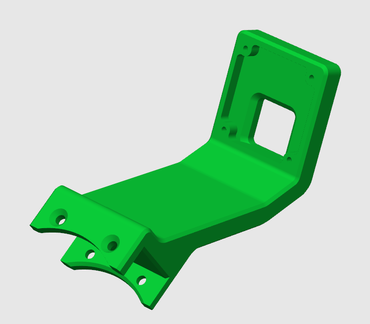
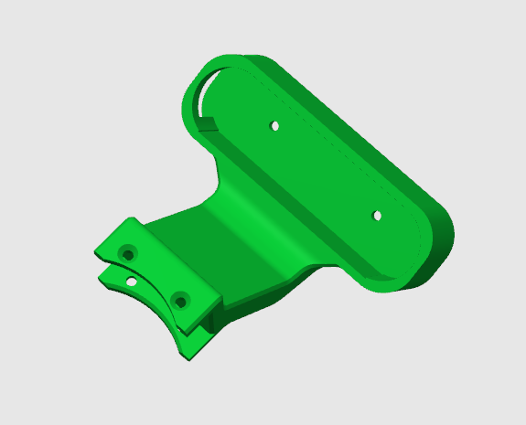
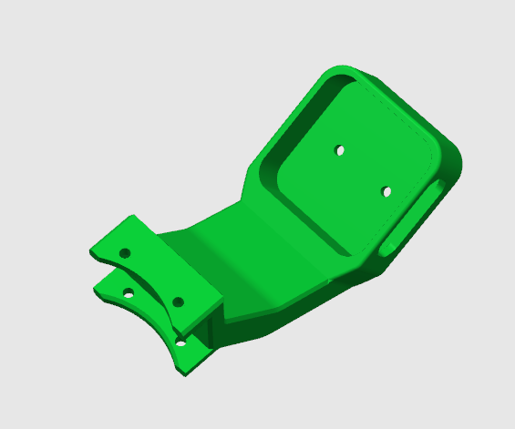
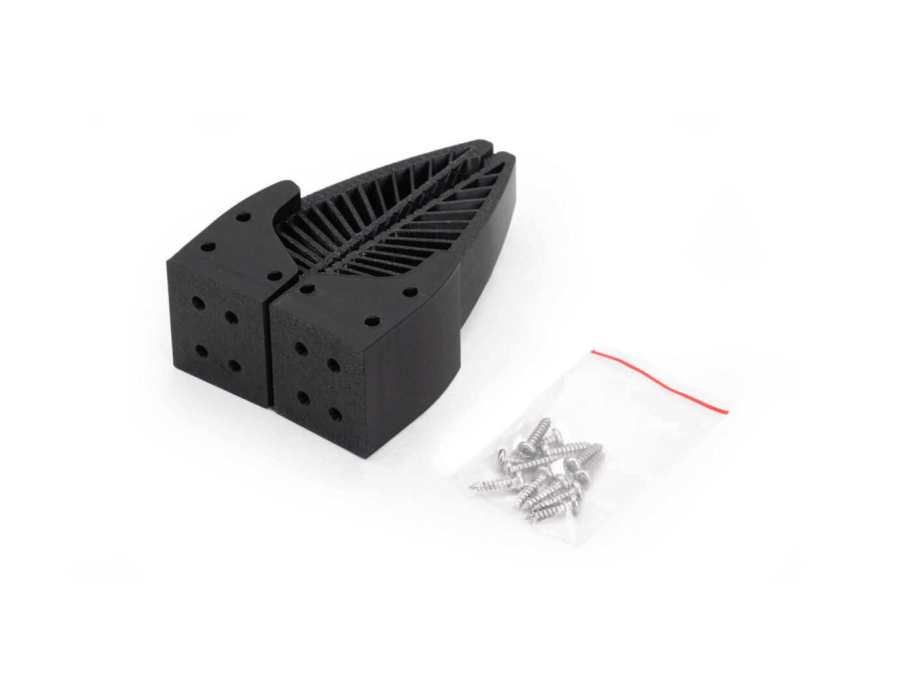
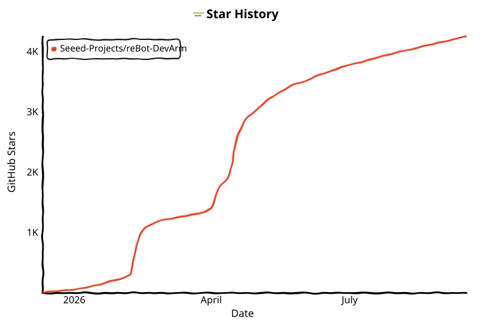

# 🦾 reBot-DevArm

**El brazo robótico de código abierto para todos los desarrolladores**

**100% código abierto · IA corpórea · Stack completo de hardware + software**

🌐 [Página de inicio](https://279070161-sketch.github.io/reBot/) · 📚 [Centro de tutoriales](https://wiki.seeedstudio.com/robotics_page/) · ▶ [Demo en línea](https://yang-ci.github.io/Rebot_Arm_AGV/)

[简体中文](README_zh.md) · [English](README.md) · [日本語](README_JP.md) · [français](README_Fr.md) · [Español](README_es.md)

---

## 📑 Contenido

- [📖 Introducción](#introducción)
- [🛒 Consigue tu reBot Arm](#consigue-tu-rebot-arm)
- [🚀 Prueba la simulación en línea](#prueba-la-simulación-en-línea)
- [🗺️ Hoja de ruta](#hoja-de-ruta)
- [⚙️ Especificaciones de hardware](#especificaciones-de-hardware)
- [🌟 Proyectos de la comunidad](#proyectos-de-la-comunidad)
- [🧹 Hardware opcional](#hardware-opcional)
- [🎓 Ecosistema de robótica integral](#ecosistema-de-robótica-integral)
- [🙌 Agradecimientos y contribuidores](#agradecimientos-y-contribuidores)
- [📄 Licencia](#licencia)
- [☎ Contacto](#contacto)

---

## 📖 Introducción

**reBot-DevArm** —— **reBot Arm B601-DM** y **reBot Arm B601-RS** —— es un proyecto de brazo robótico dedicado a reducir la barrera de aprendizaje de la IA corpórea (Embodied AI). Creemos en el «verdadero código abierto»: no solo el código, sino todo, liberado sin reservas.

- 🦾 **Dos modelos de brazo** —— Todos los archivos de diseño del **B601-DM (Damiao)** y el **B601-RS (Robstride)**, dos brazos con la misma apariencia.
- 🛠️ **Planos de hardware** —— Archivos fuente de las piezas de chapa metálica y de las piezas impresas en 3D.
- 🔩 **Lista BOM** —— Detallada hasta la especificación y el enlace de compra de cada tornillo.
- 💻 **Software y algoritmos** —— SDK de Python, ROS1/2, Isaac Sim, LeRobot y más.

## 🛒 Consigue tu reBot Arm

| Modelo | Tienda oficial | Otros canales |
| :--- | :--- | :--- |
| **reBot Arm B601-DM** | [SeeedStudio Bazaar](https://www.seeedstudio.com/reBot-Arm-B601-DM-Assembled-Kit-with-Power-Supply-Bundle.html) | [Amazon](https://www.amazon.com/dp/B0H2TWVFSW) · [AliExpress](https://de.aliexpress.com/item/1005012108314029.html) |
| **reBot Arm B601-RS** | [SeeedStudio Bazaar](https://www.seeedstudio.com/reBot-Arm-B601-RS-Bundle-p-6898.html) | [AliExpress](https://www.aliexpress.us/item/3256812343811970.html?gatewayAdapt=deu2usa4itemAdapt) |

### Opciones de kit B601-DM

Hay cinco opciones de kit disponibles en [SeeedStudio.com](https://www.seeedstudio.com/reBot-Arm-B601-DM-Bundle.html):

- **Kit de motores del cuerpo del brazo** —— Solo motores y mazos de cables.
- **Kit estructural del cuerpo del brazo** —— Solo componentes estructurales mecánicos.
- **Kit completo de pinza (gripper)** —— Motores, cableado y estructura de la pinza.
- **Kit completo** —— Cuerpo del brazo y pinza completos.
- **Brazo robótico premontado** —— Totalmente ensamblado, listo para usar.

> 💡 El kit no incluye adaptador de corriente ni abrazaderas en C de serie, ya que puedes alimentarlo con baterías o montarlo sobre una base DIY. Compra por separado una [fuente de alimentación](https://www.seeedstudio.com/AC-DC-Power-Adapter-IEC-60320-C14-XT30-Female-24V-4-5A-1200mm-L190-W92-5-H36mm-p-6764.html) y un [cable de alimentación](https://www.seeedstudio.com/reServer-AC-US-p-5052.html), o consulta la solución Mean Well al final de la [BOM](./hardware/reBot_B601_DM/readme.md#about-power-supply).

### Opciones de kit B601-RS

Hay dos opciones de kit disponibles en [SeeedStudio.com](https://www.seeedstudio.com/reBot-Arm-B601-RS-Assembled-Kit-with-Gripper-p-6865.html):

- **Kit completo** —— Cuerpo del brazo y pinza completos sin ensamblar.
- **Brazo robótico premontado** —— Totalmente ensamblado, listo para usar.

> 💡 Recomendamos la fuente [Mean Well 48V 12.5A](https://www.amazon.com/sspa/click?ie=UTF8&spc=MTo0NzgzODk2NzUxNTQ0NzEyOjE3ODE2MTA2NTU6c3BfYXRmOjIwMDExNjA5NjQwMTc5ODo6MDo6&url=%2FLRS-350-48-Price-Switching-Supply-MeanWell%2Fdp%2FB0BP6S5DYR%2Fref%3Dsr_1_1_sspa%3Fcrid%3D27VPQOWNPN9UG%26dib%3DeyJ2IjoiMSJ9.qK84sGJa4-74kbCEX11MOFBju8sSQUdFsbHw6PNvmaEHnhzjX2T7dyhRNJY01mXxpWk8lccGOwnezxmqLKUjqglX_FI26mrxlvZf0KNiLdJ8QnhKsber4KDoyyLHNxWGV451uHCzZbCDXxM0iYXVnubuVourRaRURlyMorRavuLd2a32kABx-BKqyF5Dfr7dV453ecE6QULFqG-UVLBaBRijbxQGTJ2YiNyXAqn3bkM.Bt5mAPOJNAWGnXCC2mwvjdDdccZd1_0-WRXZpP4mR4M%26dib_tag%3Dse%26keywords%3DLRS-350-48%26qid%3D1781610655%26sprefix%3Dlrs-350-%252Caps%252C331%26sr%3D8-1-spons%26sp_csd%3Dd2lkZ2V0TmFtZT1zcF9hdGY%26psc%3D1) para el modelo RS. Para un rendimiento total, opta por un adaptador de 48V 25A.

### Brazo líder (Leader Arm, opcional)

Compra el [Leader Arm](https://www.seeedstudio.com/Star-Arm-102-p-6765.html?qid=P2U7IG_yskyak5m_1776415593315) y una [fuente de 12V 10A](https://www.seeedstudio.com/FY1209900-12V-10A-Power-Adapter-12V-10A-p-6496.html); el adaptador de 12V DC del SO-ARM101 también sirve.

## 🚀 Prueba la simulación en línea

Experimenta el gemelo digital MuJoCo del reBot Arm B601-RS directamente en tu navegador, sin instalación. Alterna entre el brazo estándar y la configuración AGV, controla las articulaciones y el TCP, consulta las cámaras cenital y de muñeca D405, y ejecuta las demos automáticas de recogida y apilado. La primera carga del modelo puede tardar unos instantes; se recomienda Chrome o Edge.

  <a href="https://yang-ci.github.io/Rebot_Arm_AGV/"><strong>▶ Iniciar la demo interactiva de reBot Arm</strong></a>

## 🗺️ Hoja de ruta

Mantenemos y adaptamos continuamente los principales ecosistemas de desarrollo robótico. A continuación, nuestro progreso y plan de lanzamiento.

### reBot Arm B601-DM

| Ecosistema | Estado | Descripción | Documentación |
| :--- | :---: | :--- | :--- |
| Uso básico de motores | ✅ Completado | Control de movimiento y encapsulación de API | [Damiao Technology](https://wiki.seeedstudio.com/cn/damiao_series/) |
| Piezas STEP 3D y BOM | ✅ Completado | Archivos STEP, BOM y precios de referencia | [BOM del reBot Arm B601-DM](./hardware/reBot_B601_DM/readme.md) |
| Pruebas de rendimiento en máquina real | ✅ Completado | Rendimiento en condiciones normales y extremas | [Performance Testing](./hardware/reBot_B601_DM/performance_testing/Performance_Testing.md) |
| Vídeo de montaje | ✅ Completado | Pasos de montaje ultradetallados y vídeo | [Getting Started](https://wiki.seeedstudio.com/rebot_b601_dm_getting_started/) |
| SDK de Python | ✅ Completado | Lectura/escritura y control todo en uno de motores Robstride, Damiao, Mota, Gaoqing, Hexfellow… | [Motorbridge](https://motorbridge.seeedstudio.com) · [Web UI](https://rebot-devarm.w0x7ce.eu/) |
| Integración ROS2 | ✅ Completado | Cinemática, planificación de trayectorias y compensación de gravedad | [Guía ROS2](https://wiki.seeedstudio.com/rebot_arm_b601_dm_ros2_integration/) |
| Integración Pinocchio | ✅ Completado | Cinemática directa/inversa y compensación de gravedad | [Guía Pinocchio](https://wiki.seeedstudio.com/rebot_arm_b601_dm_pinocchio_meshcat/) · [Repositorio](https://github.com/Seeed-Projects/reBotArm_control_py) |
| Simulación Isaac Sim | ✅ Completado | Modelos USD y teleoperación simulada | [Wiki](https://wiki.seeedstudio.com/rebot_arm_b601_dm_isaacsim/) |
| Integración LeRobot | ✅ Completado | Framework de entrenamiento LeRobot de Hugging Face | [Guía LeRobot](https://wiki.seeedstudio.com/rebot_arm_b601_dm_lerobot/) |
| Integración de cámara de profundidad | ✅ Completado | Demo de agarre visual con YOLO y cámara de profundidad | [Demo de agarre](https://wiki.seeedstudio.com/rebot_arm_b601_dm_grasping_demo/) |
| Integración de voz reSpeaker | ✅ Completado | Matriz de 4 micrófonos reSpeaker Flex, control por voz con percepción espacial | [Control por voz](https://wiki.seeedstudio.com/control_rebot_arm_using_voice_with_respeaker_flex/) |
| Últimos algoritmos | ⏳ Planificado | Algoritmos principales actualizados progresivamente | En curso |
| Serie de cursos gratuitos | ⏳ Planificado | Una serie de cursos completamente gratuitos | En curso |

#### Contribuciones de la comunidad

| Ecosistema | Autor | Descripción | Repositorio |
| :--- | :---: | :--- | :--- |
| ROS2 (Humble), integración de terceros, URDF / rebotarm_bringup | [@danieldoradotalaveron-rb](https://github.com/danieldoradotalaveron-rb) | 1. **Monitor pasivo de diagnósticos** (`rebotarm_monitor_ros2`) —— superposición `/diagnostics` para `rqt_robot_monitor`, agregador serial/CAN; 2. **Aparcamiento y apagado seguros** —— captura la pose de reposo y retorno lento al apagar o con `/rebotarm/park`; 3. **Compensación de gravedad (parada suave)** —— rampa MIT para eliminar golpes y tirones en la transición pos/vel; 4. **Teleoperación con gamepad (IK/FK + seguridad)** —— control del efector final por IK, visualización en RViz (solo simulación); 5. **TF de la D405 eye-in-hand** —— Xacro bajo `end_link` para visualización RViz y TF. | [rebotarm_monitor_ros2](https://github.com/danieldoradotalaveron-rb/rebotarm_monitor_ros2) · [reBotArmController_ROS2](https://github.com/danieldoradotalaveron-rb/reBotArmController_ROS2) |

### reBot Arm B601-RS

| Ecosistema | Estado | Descripción | Documentación |
| :--- | :---: | :--- | :--- |
| Uso básico de motores | ✅ Completado | Control de movimiento y encapsulación de API | [Robstride](https://wiki.seeedstudio.com/cn/robstride_control/) |
| Piezas STEP 3D y BOM | ✅ Completado | Archivos STEP, BOM y precios de referencia | [BOM del reBot Arm B601-RS](./hardware/reBot_B601_RS/README.md) |
| Puesta en marcha | ✅ Completado | Inicio rápido del B601-RS | [Getting Started](https://wiki.seeedstudio.com/rebot_b601_rs_getting_started/) |
| Vídeo de montaje | ✅ Completado | Pasos de montaje ultradetallados y vídeo | [Vídeo de montaje](https://wiki.seeedstudio.com/rebot_b601_rs_getting_started/) |
| ROS2 (Humble) | ✅ Completado | Cinemática, planificación de trayectorias, compensación de gravedad y MoveIt2 | [Guía ROS2](https://wiki.seeedstudio.com/rebot_arm_b601_rs_ros2_integration/) |
| Integración LeRobot | ✅ Completado | Framework de entrenamiento LeRobot de Hugging Face | [Guía LeRobot](https://wiki.seeedstudio.com/rebot_arm_b601_rs_lerobot/) |
| Integración Pinocchio | ✅ Completado | Cinemática directa/inversa y compensación de gravedad | [Guía Pinocchio](https://wiki.seeedstudio.com/rebot_arm_b601_rs_pinocchio_meshcat/) · [Repositorio](https://github.com/Seeed-Projects/reBotArm_control_py) |
| Integración de cámara de profundidad | ✅ Completado | Demo de agarre visual con YOLO y cámara de profundidad | [Demo de agarre](https://wiki.seeedstudio.com/rebot_arm_b601_rs_grasping_demo/) |
| Arquitectura de agente corpóreo | ✅ Completado | Recibe comandos en lenguaje natural (p. ej. «pick up the red block»), planifica y ejecuta el agarre automáticamente | [Diseño](https://wiki.seeedstudio.com/wrc_demo_tutorial/) · [Código fuente](https://github.com/TheMoonAstronaut/wrc.git) |
| Simulación Isaac Sim | ✅ Completado | Modelos USD y teleoperación simulada | [Curso DLI](https://www.seeedstudio.com/sim-to-real-with-seeed-rebot-and-nvidia-isaac) · [Repositorio](https://github.com/Seeed-Projects/reBot-Isaacsim) |
| Últimos algoritmos | ⏳ Planificado | Algoritmos principales actualizados progresivamente | En curso |
| Serie de cursos gratuitos | ⏳ Planificado | Una serie de cursos completamente gratuitos | En curso |

## ⚙️ Especificaciones de hardware

Diseñado para aplicaciones de IA corpórea de sobremesa, equilibrando carga útil y flexibilidad.

| Parámetro | reBot Arm B601-DM | reBot Arm B601-RS |
| :--- | :--- | :--- |
| Carga útil | 1.5 kg | **2.5 kg** |
| Espacio de trabajo recomendado | 70% del alcance del brazo | 70% del alcance del brazo |
| Alcance máximo | 767 mm | **754 mm** |
| Peso | **≈ 4.5 kg** | ≈ 6.7 kg |
| Repetibilidad | < 0.2 mm | < 0.2 mm |
| Grados de libertad | 6 DOF + 1 pinza | 6 DOF + 1 pinza |
| Ecosistemas compatibles | ROS1, ROS2, LeRobot, Pinocchio, Isaac Sim, SDK de Python | ROS1, ROS2, LeRobot, Pinocchio, Isaac Sim, SDK de Python |
| Tensión de alimentación | DC 24V | DC 48V |

## 🌟 Proyectos de la comunidad

|  |  |  |  |  |
| :---: | :---: | :---: | :---: | :---: |
|  [De GEM-4](https://www.kaggle.com/competitions/gemma-4-good-hackathon/writeups/new-writeup-1778618527713) |  [De Linyan Fu](https://x.com/Linyan_Fu/status/2056383947341525180) · [Apheth D Almeida](https://x.com/Apheth_DAlmeida/status/2053503164507476096) |  [De Dhruv Diddi](https://x.com/DhruvDiddi/status/2046605015008383284) |  [De Ed Henderson](https://x.com/ed0henderson/status/2055076839002095743) |  Sameer |
|  [De Binh Pham](https://x.com/pham_blnh/status/2061994096374505710) |  [De FangTianChongHui](https://www.instagram.com/reel/DY7Ny8OPjVu/?utm_source=ig_web_copy_link&igsh=NTc4MTIwNjQ2YQ==) |  [Xense YaoLin Dong](https://x.com/dong1505lin) |  [De Ed Henderson](https://x.com/ed0henderson/status/2055076839002095743) |  [De yoshikai_man](https://x.com/yoshikai_man/status/2079938975398244705) |
|  [De hei-rebot-lift](https://github.com/lipengdong/hei-rebot-lift) |  [De Martin Kemka](https://www.linkedin.com/posts/activity-7484390995862781952-TX4m?utm_source=share&utm_medium=member_desktop&rcm=ACoAAE6WUL4BWkFeyUj0TJ5JlGf6IG4iRHAicUo) |  [De Kamil Buczyński](https://www.linkedin.com/posts/kamil-buczy%C5%84ski-102843301_seeedstudio-rebotarm-seeedprojectofthemonth-ugcPost-7485297094715461633-RV_6/?utm_source=share&utm_medium=member_desktop&rcm=ACoAAE6WUL4BWkFeyUj0TJ5JlGf6IG4iRHAicUo) |  [De Daniel Dorado](https://www.linkedin.com/posts/doradodaniel_computervision-spatialai-sim2real-share-7474727487374184448-NhwX/?utm_source=share&utm_medium=member_desktop&rcm=ACoAAE6WUL4BWkFeyUj0TJ5JlGf6IG4iRHAicUo) |  [De Asier](https://www.linkedin.com/posts/asierarranz_nvidia-physicalai-isaaclab-ugcPost-7480271721942417408-YNwu/?utm_source=share&utm_medium=member_desktop&rcm=ACoAAE6WUL4BWkFeyUj0TJ5JlGf6IG4iRHAicUo) |

   
  <a href="https://www.seeedstudio.com/sim-to-real-with-seeed-rebot-and-nvidia-isaac">Seeed reBot Arm × NVIDIA Isaac —— Curso Sim-to-Real VLA</a>

## 🧹 Hardware opcional

### Soporte de cámara para la muñeca

| UVC 32×32 | Intel D435i | Intel D405 & Gemini 305 | Gemini 2 |
| :--- | :--- | :--- | :--- |
|  |  |  |  |
| [STEP](hardware/reBot_B601_DM/3D_Printed_Parts/UVC32_mount.step) | [STEP](hardware/reBot_B601_DM/3D_Printed_Parts/D435_Gemini2_Mount.step) | [STEP](hardware/reBot_B601_DM/3D_Printed_Parts/D405_305_Mount.step) · [notas de diseño](https://github.com/bowenszhu/rebot-b601-rs-d405-wrist-mount/tree/v1.0.0) | [STEP](hardware/reBot_B601_DM/3D_Printed_Parts/D435_Gemini2_Mount.step) |

### Compatible con el Leader Arm

| Star Arm 102-LD | Abierto a integraciones de compatibilidad |
| :--- | :--- |
|  | [Centro de la serie](https://fashionstar.com.hk/robot-arm/star-arm-102/) · [Repositorio GitHub](https://github.com/servodevelop/Star-Arm-102) |

### Dedo blando DIY

| Dedo blando | Abierto a integraciones de compatibilidad |
| :--- | :--- |
|  | Próximamente |
| [Soporte del dedo (ABS/PLA)](hardware/reBot_B601_DM/3D_Printed_Parts/Soft_Gripper_Mount.step) · [Dedo (TPU 95+)](hardware/reBot_B601_DM/3D_Printed_Parts/Soft_Gripper_Finger.step) | Próximamente |

### Hardware opcional recomendado

| Categoría | Tipo | Vista previa | Producto | Enlace |
| :--- | :--- | :--- | :--- | :--- |
| **Cámara** | Cámara de profundidad |  | **Orbbec Gemini 2 3D Camera** | [Seeed Studio](https://www.seeedstudio.com/Orbbec-Gemini-2-3D-Camera-p-6464.html) |
| **Cámara** | Cámara de profundidad |  | **Orbbec Gemini 336 Depth Camera** | [Seeed Studio](https://www.seeedstudio.com/Orbbec-Gemini-336-3D-Camera-3D-p-6662.html) |
| **Cámara** | Cámara de profundidad |  | **Orbbec Gemini 335LG 3D Camera** | [Seeed Studio](https://www.seeedstudio.com/Orbbec-Gemini-335LG-3D-Camera-p-6541.html) |
| **Cámara** | Cámara de profundidad |  | **SLAMTEC Aurora S** | [Seeed Studio](https://www.seeedstudio.com/SLAMTEC-Aurora-S-AI-Integrated-Spatial-Perception-System-p-6669.html) |
| **Cámara** | Cámara de profundidad |  | **Intel RealSense Depth Camera D435i** | [Seeed Studio](https://www.seeedstudio.com/Intel-RealSense-Depth-Camera-D435i-p-4423.html) |
| **Cámara** | Cámara de profundidad |  | **RealSense Depth Camera D405** | [Seeed Studio](https://www.seeedstudio.com/RealSense-D405-3D-Camera-p-6758.html) |
| **Cámara** | Cámara monocular |  | **Sensing SG3S-ISX031C-GMSL2F 3MP GMSL2 Camera** | [Seeed Studio](https://www.seeedstudio.com/SG3S-ISX031C-GMSL2F-p-6245.html) |
| **Cámara** | Cámara monocular |  | **ET-S231 Megapixel 120° gran angular 1080P USB** | [Seeed Studio](https://www.seeedstudio.com/ET-S231-120-USB-Camera-p-6683.html) |
| **Micrófono** | Matriz de micrófonos |  | **reSpeaker Flex XVF3800 Circular-4 with XIAO ESP32S3** | [Seeed Studio](https://www.seeedstudio.com/reSpeaker-Flex-XVF3800-Circular-4-with-XIAO-ESP32S3-p-6739.html) |
| **Micrófono** | Matriz de micrófonos |  | **reSpeaker XMOS XVF3800** | [Seeed Studio](https://www.seeedstudio.com/ReSpeaker-XVF3800-USB-Mic-Array-p-6488.html) |
| **Controlador** | Controlador de borde |  | **reComputer J3011-Orin Nano 8GB** | [Seeed Studio](https://www.seeedstudio.com/reComputer-J3011-p-5590.html) |
| **Controlador** | Controlador de borde |  | **NVIDIA Jetson AGX Thor Developer Kit** | [Seeed Studio](https://www.seeedstudio.com/NVIDIA-Jetson-AGX-Thor-Developer-Kit-p-9965.html) |

## 🎓 Ecosistema de robótica integral

reBot-DevArm no es solo un brazo robótico, sino una comunidad de aprendizaje de robótica. Compartimos gratis los siguientes tutoriales generales:

**🖥️ Computación en el borde y control maestro**

-  —— Inferencia de IA y núcleo de computación
-  —— Entorno general de desarrollo Linux
- [-0091BD?style=for-the-badge&logo=espressif&logoColor=white)](https://wiki.seeedstudio.com/SeeedStudio_XIAO_Series_Introduction/) —— Nodo de control inalámbrico de bajo consumo

**📡 Sensores y periféricos**

- **Motores y servos** —— [Damiao / Gogo / Robstride / Mita / Feite / Fashion Star](https://wiki.seeedstudio.com/robotics_page/)
- **Percepción visual** —— [Cámaras de profundidad / LiDAR / algoritmos de visión](https://wiki.seeedstudio.com/robotics_page/)
- **Interacción por voz** —— [Matrices de micrófonos reSpeaker / control por voz / percepción espacial (DoA)](https://wiki.seeedstudio.com/control_rebot_arm_using_voice_with_respeaker_flex/)
- **Movimiento y actitud** —— [IMU (6/9 ejes) / giroscopios / magnetómetros](https://wiki.seeedstudio.com/Sensor_accelerometer/)
- **Kits completos** —— [Más sensores de robótica y ejemplos de drivers](https://wiki.seeedstudio.com/robotics_page/)

> 👉 **[Entra en la base de conocimientos de la Wiki](https://wiki.seeedstudio.com/)** —— todos los tutoriales se consultan gratis.

## 🙌 Agradecimientos y contribuidores

El camino del código abierto nunca es solitario. El proyecto reBot-DevArm no existiría sin el apoyo de Seeed Studio, la comunidad global de código abierto y nuestros socios de hardware.

**🌍 Ecosistema y soporte de software**

- [Seeed Studio](https://www.seeedstudio.com/) —— Cadena de suministro de hardware y soporte técnico
- [Hugging Face LeRobot](https://github.com/huggingface/lerobot) —— Framework de aprendizaje robótico de extremo a extremo
- [NVIDIA Isaac Sim](https://developer.nvidia.com/isaac/sim) —— Plataforma de simulación robótica y datos sintéticos

**⚙️ Socios principales de hardware**

- [Damiao Technology](https://www.damiaokeji.com/)
- [Robstride](https://robstride.com/)
- [Fashion Star](https://fashionstar.com.hk/wiki/)

**💡 Inspiración**

- [SO-ARM100](https://github.com/TheRobotStudio/SO-ARM100/tree/main)
- [Mobile ALOHA](https://github.com/tonyzhaozh/aloha)
- [Dummy-Robot (Zhihui Jun)](https://github.com/peng-zhihui/Dummy-Robot)
- [OpenArm](https://openarm.dev/)
- [I2RT](https://i2rt.com/)
- [TRLC-DK1](https://github.com/robot-learning-co/trlc-dk1)

**🎃 Contribuidores del prototipo**

- Equipo de IA y robótica de SeeedStudio —— Yaohui Zhu (yaohui.zhu@seeed.cc)
- SeeedStudio STU —— Wentao Dong
- SeeedStudio STU —— Weiwei Xu
- Departamento de compras de SeeedStudio —— Fengqun Peng

**👥 Contribuidores**

*Próximamente… ¡Anímate a enviar PR para convertirte en contribuidor!*

### ⭐ Historial de estrellas

<picture>
  <source media="(prefers-color-scheme: dark)" srcset="assets/star-history/star-history-dark.svg">
  <source media="(prefers-color-scheme: light)" srcset="assets/star-history/star-history-light.svg">
  
</picture>

## 📄 Licencia

- **Diseño de hardware** © 2026 Seeed Studio Co., Ltd. —— publicado bajo [CERN-OHL-W-2.0](https://ohwr.org/cern_ohl_w_v2.txt)
- **Código del firmware** © 2026 Seeed Studio Co., Ltd. —— publicado bajo [Apache-2.0](https://www.apache.org/licenses/LICENSE-2.0)

### Derechos y restricciones

El proyecto reBot Arm siempre se ha regido por la filosofía de **agilidad, apertura, responsabilidad y simbiosis** al servicio de la comunidad. Nuestra visión es que cada entusiasta domine la arquitectura de hardware y los principios de software de los brazos robóticos, y experimente los algoritmos de vanguardia de la inteligencia corpórea a través de reBot.

Durante los primeros cinco meses el proyecto usó la licencia **CC BY-SA NC (no comercial)**, para que los desarrolladores pudieran centrarse en iterar y mejorar el producto en su fase inicial. Tras meses de pulido, **desde el 11 de mayo de 2026** el proyecto pasó a la licencia **CERN-OHL-W 2.0**, logrando un **código abierto 100% integral (hardware y software) con plenos derechos de uso comercial en todos los escenarios**.

El hardware y el software usan licencias diferentes; confirma los términos aplicables a la parte que utilices.

| Elemento | Hardware (CERN-OHL-W-2.0) | SDK de software (Apache-2.0) |
| :--- | :--- | :--- |
| ✅ Uso comercial | ✅ Permitido | ✅ Permitido |
| ✅ Modificación | ✅ Permitida | ✅ Permitida |
| ✅ Redistribución | ✅ Permitida | ✅ Permitida |
| ✅ Integración en código cerrado | ❌ Condicional (ver [CERN-OHL-W-2.0](https://ohwr.org/cern_ohl_w_v2.txt)) | ✅ Permitida (sin obligación de divulgar) |
| ⚠️ Conservación del copyright | ✅ Obligatoria | ✅ Obligatoria |
| ⚠️ Conservación del texto de licencia | ✅ Obligatoria | ✅ Obligatoria |
| ⚠️ Aviso de modificación | ✅ Obligatorio (fecha + descripción) | ✅ Obligatorio (descripción) |
| ⚠️ Concesión de patentes | ✅ Explícita | ✅ Explícita |
| ⚠️ Entrega de fuentes al distribuir | ✅ Se **debe** proporcionar la «fuente completa» | ❌ No obligatorio |
| ⚠️ Compatibilidad con módulos externos/cerrados | ✅ Permitida (Weakly Reciprocal) | ✅ Totalmente permitida |
| 🔗 Relación con otros componentes | Los módulos de interfaz independientes (External Material) pueden permanecer cerrados | Sin restricciones |
| 📄 Texto oficial completo | [CERN-OHL-W-2.0](https://ohwr.org/cern_ohl_w_v2.txt) | [Apache-2.0](https://www.apache.org/licenses/LICENSE-2.0) |

## ☎ Contacto

- **Progreso del código abierto y soporte técnico** —— Yaohui: yaohui.zhu@seeed.cc
- **Colaboraciones futuras y personalización** —— Elaine: elaine.wu@seeed.cc
